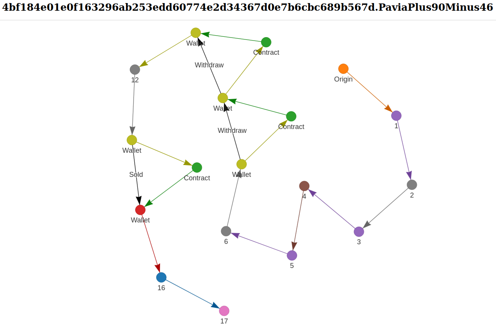

# CNFT-Origin-Trace

A python script to perform an origin trace on a cnft.



## What is this graph?

This is a directed graph where each node is a unique wallet and each colored edge is a transaction going between unique wallets. The darker edges represent either a withdraw and sell action. Each color is defined by the amount of unique wallets so if the colors are equal then its the same wallet

### Requirements
This file requires a mainnet Blockfrost api key.

```bash
# Requires a mainnet Blockfrost api key.
echo ${BLOCKFROST_API_KEY} >> blockfrost_api.key
```

Python 3.9+, networkX, and pyVis will be needed.

```bash
pip install -r requirements.txt
```

## How to use

Import origin trace and use the create html page function. This will create a nx.html file inside the local folder.

```py
from origin_trace import create_html_page
policy_id              = "8634f3bf5cd864c4b661ff25789ae0154b34084d431c222d242bc39c"
asset_name             = "DEADTRAILLOGIC11"
smart_contract_address = "addr1wyl5fauf4m4thqze74kvxk8efcj4n7qjx005v33ympj7uwsscprfk"
create_html_page(
    policy_id,
    asset_name,
    smart_contract_address,
    print_flag=True,
    save_flag=True
)
```

If print is set to true, it will display the information inside the terminal and attempt to open nx.html. 

If save is set to true then it will just save the nx.html file to the local folder and it will save all the addresses and transactions into a json file, cnft_history.json.

This file can also be used directly from the terminal.

```bash
python origin_trace.py \
8634f3bf5cd864c4b661ff25789ae0154b34084d431c222d242bc39c \
DEADTRAILLOGIC11
```


.
